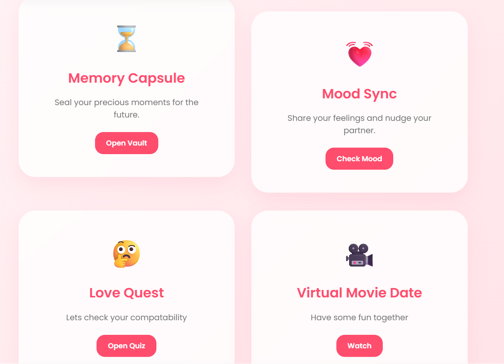
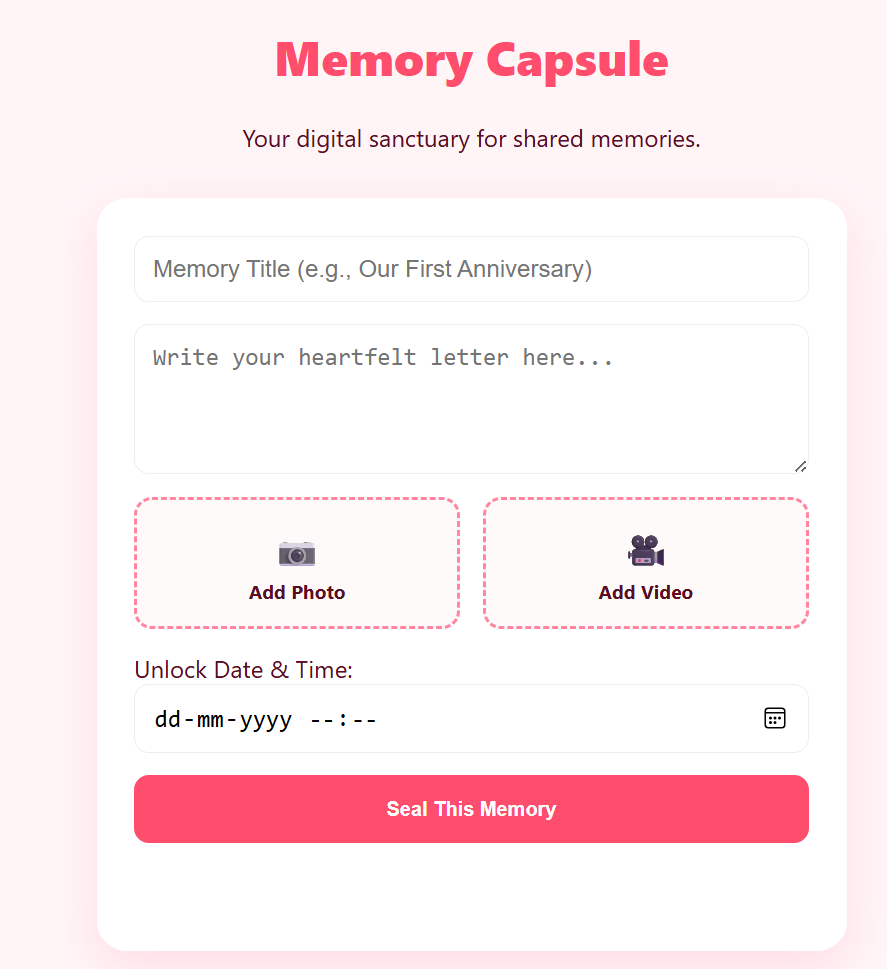
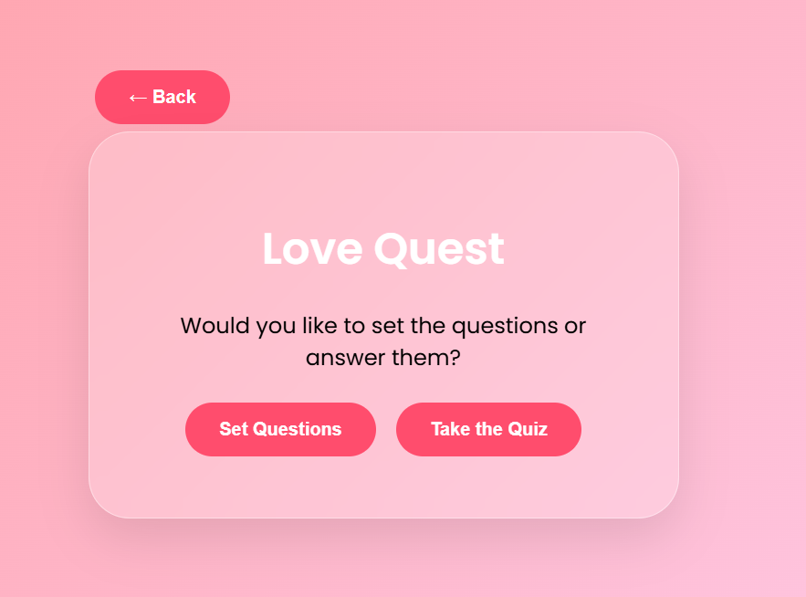
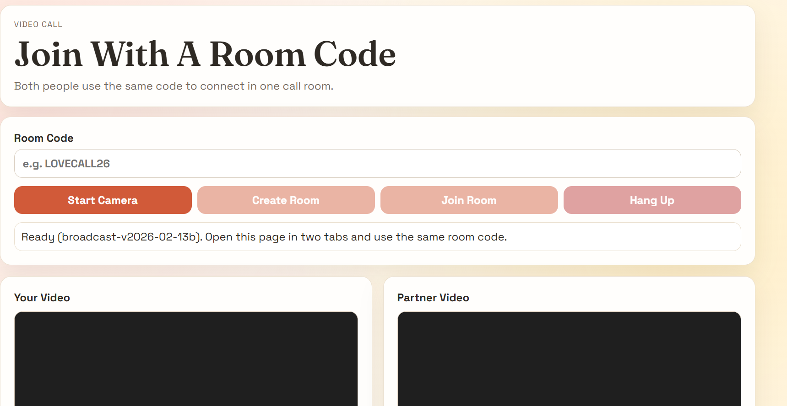

# Distance Doesn’t Delete Love

## Basic Details

### Team Name:  
Hackathon Girls

### Team Members  
- Aswani Gilesh  
- Sreya Binoi

### Hosted Project Link  
👉 (Add your Vercel hosting link here)

### Project Description  
Distance Doesn’t Delete Love is a web application designed specifically for long-distance couples to stay emotionally connected despite physical separation.
When partners move to different cities or countries for education or work, emotional distance often grows unintentionally. Our platform provides meaningful digital tools that strengthen emotional bonding and reduce feelings of loneliness in long-distance relationships.

### The Problem Statement  
Long-distance relationships often struggle due to emotional disconnect, lack of shared experiences, and limited real-time emotional awareness. Messaging apps don’t actively help couples preserve memories or communicate feelings deeply.

### The Solution  
We built a lightweight web app that allows couples to preserve emotional memories, express feelings instantly, play bonding quizzes, and enjoy virtual movie dates together even when physically apart.

---

## Technical Details

### Technologies/Components Used

For Software:

- Languages used: HTML, CSS, JavaScript  
- Tools used: Browser localStorage for storage, Vercel for hosting  
- Libraries used: None (Vanilla JavaScript)

---

## Features

List of key features of the project:

- **Memory Time Capsule:** Couples can write heartfelt messages and set a future unlock date.The message stays locked until the chosen date, creating anticipation and emotional excitement.
- **Real-Time Mood Sharing:** Partners can instantly share their current mood (Happy, Sad, Missing You, Stressed, etc.).The other person sees the update in real time, encouraging empathy and emotional understanding.
- **Relationship Quiz:** Interactive quiz for partners to strengthen bonding.  
- **Virtual Movie Date:** Paste a video URL (YouTube or link) and watch together.

---

## Implementation

### For Software:

#### Installation

1. Clone the repository
   git clone https://github.com/Aswani010906/long-distance

2. Navigate to the project folder
   cd long-distance

3. Open the project in your code editor (VS Code recommended).

#### Run

Since this is a frontend-only application, no backend setup is required.

To run locally:

Open the index.html file in your browser
OR

Use Live Server in VS Code

The application will run directly in the browser.

The deployed version is hosted on Vercel.

## Project Documentation

### Screenshots

